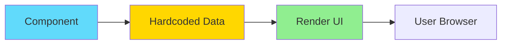
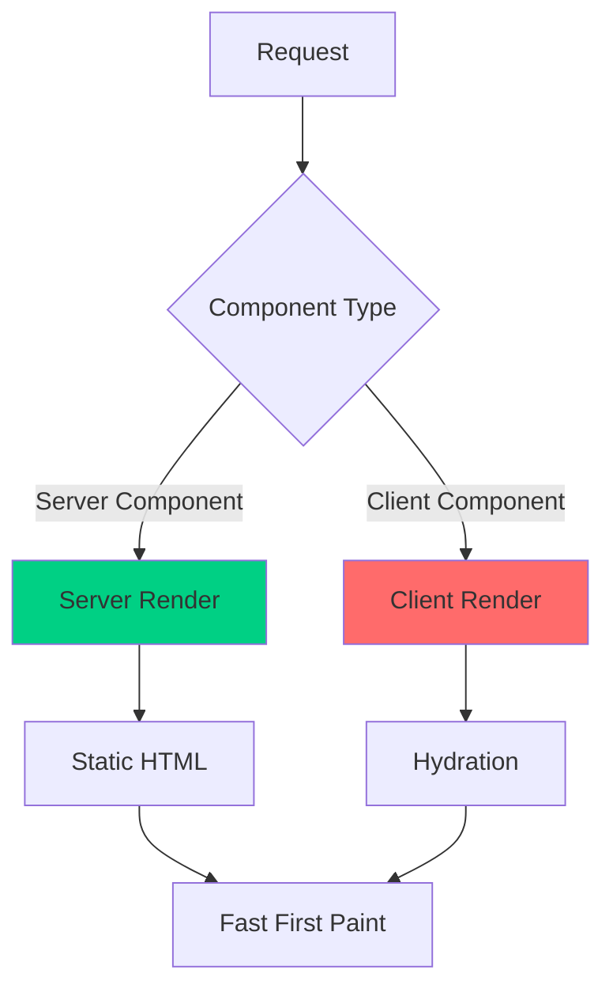
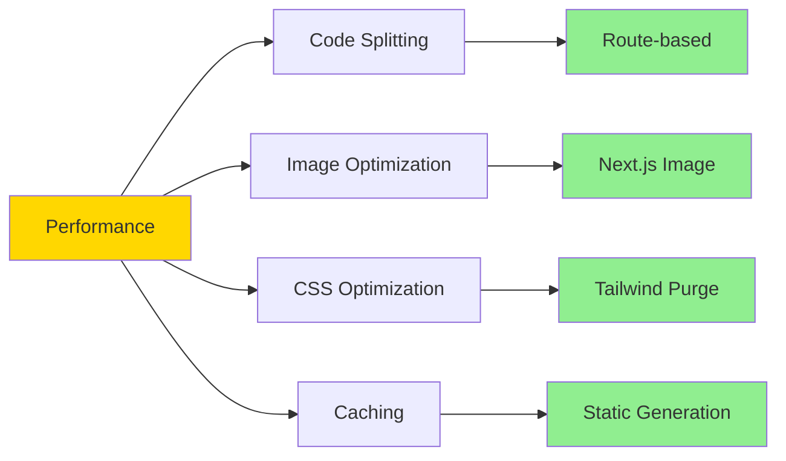
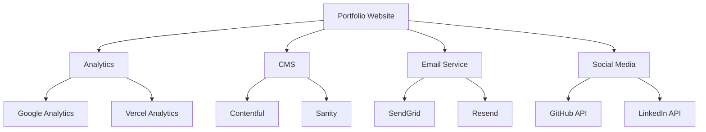

# Technical Architecture Overview

**Tanggal**: 19 Januari 2026  
**Versi Proyek**: 0.1.0

---

## 🏗️ Architecture Overview

Proyek ini menggunakan **Jamstack Architecture** dengan Next.js sebagai framework utama, mengikuti pola **Server-Side Rendering (SSR)** dan **Static Site Generation (SSG)** untuk performa optimal.

---

## 📐 Architecture Diagram

```mermaid
graph TD
    A[User Browser] --> B[Next.js App Router]
    B --> C[Pages/Routes]
    C --> D[Server Components]
    C --> E[Client Components]
    D --> F[Static Generation]
    E --> G[Client-Side Hydration]
    F --> H[HTML/CSS/JS Output]
    G --> H
    H --> I[CDN/Vercel Edge]
    I --> A

    J[Public Assets] --> I
    K[Tailwind CSS] --> L[PostCSS]
    L --> H

    style B fill:#0070f3
    style D fill:#00d084
    style E fill:#ff6b6b
    style I fill:#000000
```



---

## 🗂️ Layer Architecture

### 1. **Presentation Layer** (UI Components)

```
src/app/
├── components/          # Shared UI Components
│   ├── headerSection.tsx
│   └── footerSection.tsx
├── page.tsx            # Route Pages
├── blog/page.tsx
├── contact/page.tsx
├── portofolio/page.tsx
└── resume/page.tsx
```

**Responsibility**:

- Rendering UI
- User interactions
- Visual presentation
- Responsive layout

**Current State**:

- ✅ Basic component structure
- ⚠️ No component hierarchy (flat structure)
- ⚠️ No separation between UI and Layout components

---

### 2. **Routing Layer** (Next.js App Router)

```
App Router Structure:
/                    → Homepage
/resume              → Resume page
/portofolio          → Portfolio page
/blog                → Blog page
/contact             → Contact page
/api/*               → API routes (future)
```

**Features**:

- File-based routing
- Nested layouts support
- Loading states per route
- Error boundaries (not implemented yet)

**Current Implementation**:

```typescript
// Each route has:
page.tsx; // Route component
loading.tsx; // Loading UI (Suspense fallback)
```

---

### 3. **Styling Layer** (Tailwind CSS + Custom CSS)

```
Styling Architecture:
├── globals.css          # Global styles, animations
├── tailwind.config.js   # Tailwind configuration
└── postcss.config.js    # PostCSS processing
```

**Approach**:

- **Utility-First**: Tailwind CSS classes
- **Custom Animations**: CSS keyframes
- **No CSS Modules**: Direct Tailwind in JSX
- **No Styled Components**: Pure CSS approach

**Custom Styles**:

1. Scrollbar styling
2. Loading animations (letter-by-letter fade)
3. Typing effect animation
4. Smooth scroll behavior

---

### 4. **Asset Layer** (Static Files)

```
public/
└── profile_sya.jpg    # Profile image (224KB)

src/app/
└── user_icon.ico      # Favicon
```

**Optimization**:

- ✅ Next.js Image component untuk profile picture
- ⚠️ No image compression config
- ⚠️ No responsive image variants
- ⚠️ No WebP/AVIF format support

---

## 🔄 Data Flow Architecture

### Current State: **Static Content Only**



**No External Data Sources**:

- ❌ No API calls
- ❌ No database
- ❌ No CMS integration
- ❌ No state management

**All Data is**:

- Hardcoded in components
- Static text content
- Local images

---

## 🎨 Component Architecture

### Current Pattern: **Flat Component Structure**

```
components/
├── headerSection.tsx    # Navigation header
└── footerSection.tsx    # Footer with social links
```

**Issues**:

1. No component hierarchy
2. No reusable UI primitives
3. No composition patterns
4. Direct component usage in pages

---

### Recommended Pattern: **Atomic Design**

```
components/
├── atoms/              # Basic building blocks
│   ├── Button.tsx
│   ├── Link.tsx
│   ├── Icon.tsx
│   └── Text.tsx
├── molecules/          # Simple component groups
│   ├── NavLink.tsx
│   ├── SocialIcon.tsx
│   └── TimelineItem.tsx
├── organisms/          # Complex components
│   ├── Header.tsx
│   ├── Footer.tsx
│   ├── Navigation.tsx
│   └── Timeline.tsx
├── templates/          # Page layouts
│   ├── MainLayout.tsx
│   └── ContentLayout.tsx
└── pages/              # Page-specific components
    ├── HomeHero.tsx
    └── ResumeSection.tsx
```

---

## 🧱 Component Composition

### Current: **Monolithic Components**

```typescript
// resume/page.tsx - 351 lines, everything in one file
const resume = () => {
  return (
    <body>
      <HeaderSection />
      <div>{/* 300+ lines of JSX */}</div>
      <FooterSection />
    </body>
  );
};
```

**Problems**:

- Hard to maintain
- Hard to test
- Hard to reuse
- No separation of concerns

---

### Recommended: **Composed Components**

```typescript
// resume/page.tsx
const ResumePage = () => {
  return (
    <>
      <ResumeHero />
      <AboutSection />
      <ExperienceTimeline />
      <ProjectsTimeline />
    </>
  );
};

// components/resume/AboutSection.tsx
const AboutSection = () => {
  return (
    <Section>
      <SectionTitle>About Me</SectionTitle>
      <ProfileImage src={profilePic} />
      <PersonalInfo data={personalData} />
      <DownloadButton />
    </Section>
  );
};
```

**Benefits**:

- Easier to maintain
- Testable in isolation
- Reusable across pages
- Clear separation of concerns

---

## 🔧 Configuration Architecture

### Build Configuration

```javascript
// next.config.js
{
  experimental: { appDir: true },  // App Router
  ignoreDuringBuilds: true         // ⚠️ Skips type/lint errors
}
```

**Issues**:

1. `appDir` sudah stable (tidak perlu experimental)
2. `ignoreDuringBuilds` berbahaya untuk production

---

### TypeScript Configuration

```json
{
  "compilerOptions": {
    "strict": true, // ✅ Type safety
    "paths": { "@/*": ["./src/*"] } // ✅ Path aliases
  }
}
```

**Good Practices**:

- ✅ Strict mode enabled
- ✅ Path aliases configured
- ✅ Modern ES features

---

### Tailwind Configuration

```javascript
{
  theme: {
    extend: {
      colors: {
        brandColor: "#5BC0BE",   // Defined but unused
        darkColor: "#1C2541",
        midColor: "#3A506B",
        lightColor: "#FFFFFF"
      }
    }
  }
}
```

**Issue**: Custom colors defined tapi tidak digunakan di codebase (masih pakai `bg-black`, `text-white`)

---

## 🚀 Rendering Strategy

### Next.js 13 App Router Rendering



---

### Current Implementation

| Page      | Component Type              | Rendering |
| --------- | --------------------------- | --------- |
| Homepage  | Server                      | SSG       |
| Resume    | **Client** (`"use client"`) | CSR       |
| Blog      | Server                      | SSG       |
| Portfolio | Server                      | SSG       |
| Contact   | Server                      | SSG       |

**Issue**: Resume page menggunakan client component untuk scroll functionality, padang bisa dioptimasi dengan client islands pattern.

---

### Optimization Opportunity: **Client Islands**

```typescript
// resume/page.tsx - Server Component (default)
const ResumePage = () => {
  return (
    <>
      <ResumeHero />           {/* Server Component */}
      <ScrollButton />         {/* Client Component (island) */}
      <AboutSection />         {/* Server Component */}
      <ExperienceTimeline />   {/* Server Component */}
    </>
  );
};

// components/ScrollButton.tsx - Client Component
"use client";
const ScrollButton = () => {
  const handleClick = () => {
    // Client-side scroll logic
  };
  return <button onClick={handleClick}>...</button>;
};
```

**Benefits**:

- Smaller JavaScript bundle
- Faster initial load
- Better SEO
- Improved performance

---

## 📦 Bundle Architecture

### Current Bundle Composition

```
Production Bundle (Estimated):
├── Framework (Next.js + React)     ~85KB (gzipped)
├── Tailwind CSS (purged)           ~10KB
├── Custom CSS                      ~3KB
├── React Icons                     ~8KB
├── Page JavaScript                 ~15KB
└── Images                          ~224KB
────────────────────────────────────────────
Total:                              ~345KB
```

**Optimization Opportunities**:

1. Image compression (224KB → ~50KB)
2. Code splitting (automatic dengan App Router)
3. Tree shaking (automatic)
4. Font optimization (add next/font)

---

## 🔐 Security Architecture

### Current State: **Basic Security**

```
Security Layers:
├── Next.js Built-in Security     ✅
│   ├── XSS Protection
│   ├── CSRF Protection
│   └── Secure Headers
├── External Link Security        ⚠️ Missing rel attributes
├── Content Security Policy       ❌ Not configured
└── Rate Limiting                 ❌ Not implemented
```

**Recommendations**:

1. Add `rel="noopener noreferrer"` to external links
2. Configure CSP headers
3. Add security headers in `next.config.js`

---

## 🎯 State Management Architecture

### Current: **No State Management**

```
State Management:
├── Global State     ❌ None
├── Local State      ✅ useRef (scroll)
├── Server State     ❌ None (no API)
└── URL State        ❌ None
```

**Future Needs**:

- Contact form state
- Blog filters/search
- Theme toggle (dark/light mode)
- Language selection (i18n)

**Recommended Solutions**:

1. **React Context**: For theme, language
2. **React Hook Form**: For contact form
3. **TanStack Query**: If adding API calls
4. **Zustand/Jotai**: For complex global state

---

## 🧪 Testing Architecture

### Current: **No Testing**

```
Testing Layers:
├── Unit Tests           ❌ Not implemented
├── Integration Tests    ❌ Not implemented
├── E2E Tests           ❌ Not implemented
└── Visual Tests        ❌ Not implemented
```

**Recommended Setup**:

```
tests/
├── unit/
│   ├── components/
│   │   ├── Header.test.tsx
│   │   └── Footer.test.tsx
│   └── utils/
├── integration/
│   └── pages/
│       └── resume.test.tsx
└── e2e/
    └── user-flows.spec.ts
```

**Tools**:

- **Jest**: Unit testing
- **React Testing Library**: Component testing
- **Playwright/Cypress**: E2E testing
- **Chromatic**: Visual regression testing

---

## 📊 Performance Architecture

### Optimization Strategies



**Current Optimizations**:

- ✅ Automatic code splitting (App Router)
- ✅ Tailwind CSS purging
- ✅ Next.js Image component
- ✅ Static generation for most pages

**Missing Optimizations**:

- ❌ Font optimization (next/font)
- ❌ Image compression config
- ❌ Service Worker/PWA
- ❌ Prefetching strategy
- ❌ Bundle analyzer

---

## 🌐 Deployment Architecture

### Recommended: **Vercel Edge Network**

```mermaid
graph TD
    A[Git Push] --> B[Vercel Build]
    B --> C[Static Generation]
    C --> D[Edge Network]
    D --> E[Global CDN]
    E --> F[User - Asia]
    E --> G[User - Europe]
    E --> H[User - Americas]

    style B fill:#000000
    style D fill:#000000
    style E fill:#0070f3
```



**Benefits**:

- Zero-config deployment
- Automatic HTTPS
- Global CDN
- Edge functions
- Preview deployments
- Analytics

**Alternative**: Netlify, AWS Amplify, Self-hosted

---

## 🔄 CI/CD Architecture (Recommended)

```yaml
# .github/workflows/ci.yml
name: CI/CD Pipeline

on: [push, pull_request]

jobs:
  lint:
    - ESLint check
    - TypeScript check

  test:
    - Unit tests
    - Integration tests

  build:
    - Next.js build
    - Bundle size check

  deploy:
    - Deploy to Vercel (on main branch)
```

**Current**: ❌ No CI/CD configured

---

## 📱 Responsive Architecture

### Breakpoint Strategy

```javascript
// Tailwind default breakpoints
{
  sm: '640px',   // Mobile landscape
  md: '768px',   // Tablet
  lg: '1024px',  // Desktop
  xl: '1280px',  // Large desktop
  '2xl': '1536px' // Extra large
}
```

**Current Usage**:

- ✅ Mobile-first approach
- ✅ `md:` breakpoint untuk tablet/desktop
- ⚠️ Limited use of other breakpoints

---

## 🎨 Design System Architecture (Recommended)

```
Design System:
├── Tokens
│   ├── colors.ts
│   ├── typography.ts
│   ├── spacing.ts
│   └── animations.ts
├── Components
│   ├── Button
│   ├── Input
│   ├── Card
│   └── ...
└── Patterns
    ├── Navigation
    ├── Forms
    └── Layouts
```

**Current**: ❌ No formal design system

---

## 🔌 Integration Architecture (Future)

### Potential Integrations



---

## 📈 Scalability Considerations

### Current Scale: **Personal Portfolio**

- Low traffic expected
- Static content
- No database
- No authentication

### Future Scale: **Professional Platform**

- Blog with CMS
- Contact form submissions
- Analytics tracking
- Newsletter integration
- Project showcase with API

**Architecture Changes Needed**:

1. Add database (PostgreSQL/MongoDB)
2. Add API routes
3. Add authentication (if admin panel)
4. Add caching layer (Redis)
5. Add CDN for assets

---

## 🏁 Conclusion

### Architecture Assessment

**Strengths**:

- ✅ Modern framework (Next.js 13)
- ✅ Type safety (TypeScript)
- ✅ Performance-first (SSG/SSR)
- ✅ Scalable foundation

**Weaknesses**:

- ⚠️ Flat component structure
- ⚠️ No state management
- ⚠️ No testing
- ⚠️ Limited optimization
- ⚠️ No CI/CD

**Recommendation**:
Arsitektur dasar sudah solid untuk personal portfolio. Untuk scaling ke platform profesional, perlu refactoring component architecture, menambahkan testing, dan mengimplementasikan proper state management.

---

**Next**: Lihat checkpoint documents untuk implementation roadmap.
